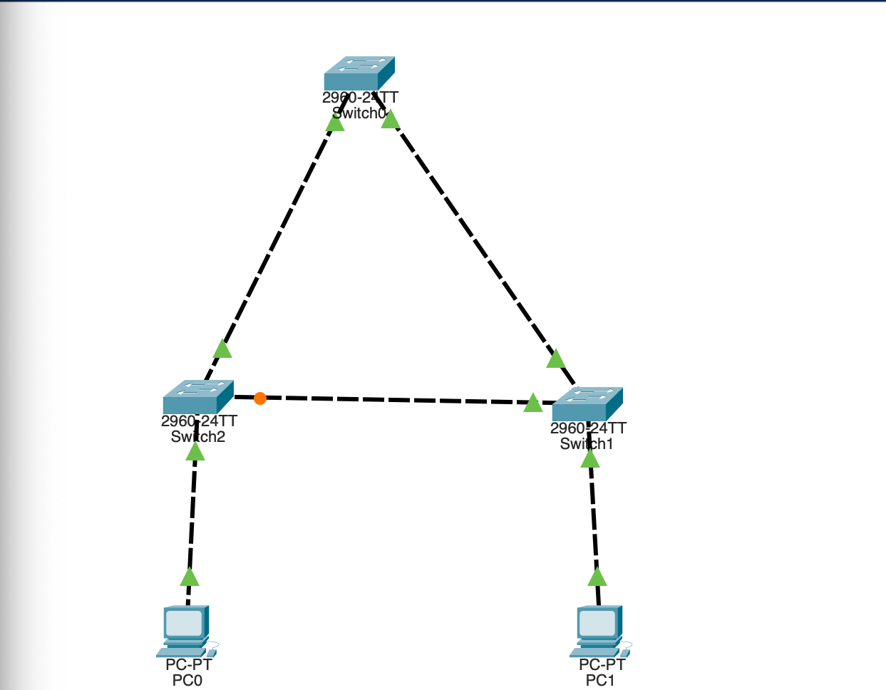
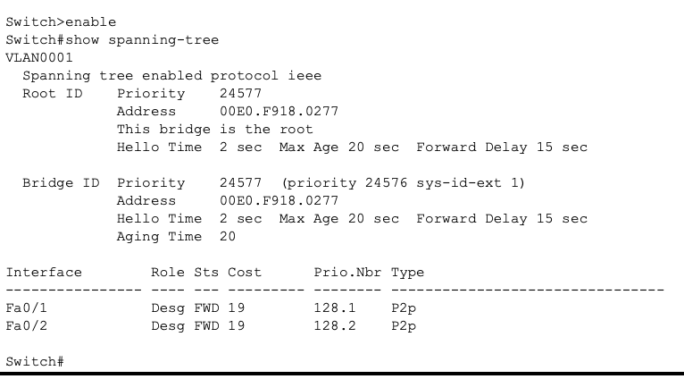
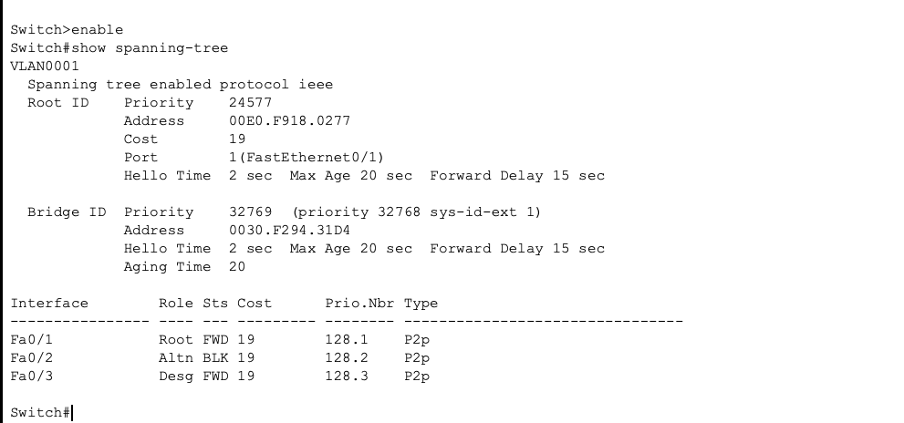
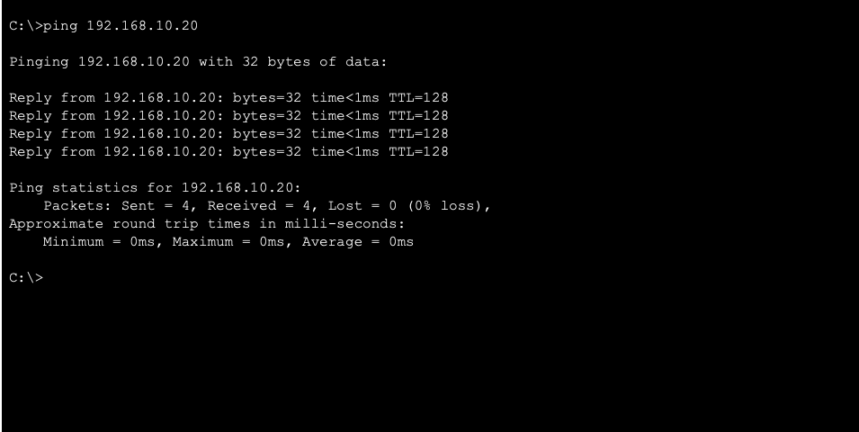

# Lab 05 — STP & Network Redundancy

## Overview

This Cisco Packet Tracer lab demonstrates how Spanning Tree Protocol (STP) prevents Layer 2 switching loops while maintaining network redundancy.

A three-switch redundant topology was created to observe STP root bridge election, port roles, blocked redundant paths, and network reconvergence after a simulated link failure.

PortFast and BPDU Guard were also configured on endpoint-facing access ports to demonstrate STP edge-port configuration and protection.

---

## Objectives

- Build a redundant Layer 2 switched network
- Observe automatic STP root bridge election
- Manually configure the STP Root Bridge
- Identify Root, Designated, and Alternate ports
- Observe STP blocking a redundant path
- Simulate a link failure and verify STP reconvergence
- Configure PortFast on endpoint-facing ports
- Configure BPDU Guard on endpoint-facing ports
- Verify end-to-end connectivity

---

## Network Topology

The topology consists of:

- 3 Cisco 2960 switches
- 2 endpoint PCs
- Redundant switch-to-switch links
- A single IPv4 LAN

### IP Addressing

| Device | IP Address | Subnet Mask |
|---|---|---|
| PC0 | 192.168.10.10 | 255.255.255.0 |
| PC1 | 192.168.10.20 | 255.255.255.0 |

Because both endpoints are on the same subnet, a default gateway was not required for this lab.



---

## Root Bridge Election

Initially, STP automatically elected the Root Bridge using the lowest Bridge ID.

Bridge ID selection is determined by:

1. Lowest bridge priority
2. Lowest MAC address when priorities are equal

I manually configured **Switch0** with a lower STP priority to make it the Root Bridge.

### Configuration

```text
enable
configure terminal
spanning-tree vlan 1 priority 24576
end
```

The configuration was verified using:

```text
show spanning-tree
```

The output confirmed that Switch0 became the Root Bridge.



---

## STP Port Roles

After STP converged, the switches assigned port roles based on the Layer 2 topology.

The observed roles included:

- **Root Port (Root/FWD)** — Best path toward the Root Bridge
- **Designated Port (Desg/FWD)** — Forwarding port for a network segment
- **Alternate Port (Altn/BLK)** — Redundant path placed into a blocking state to prevent a Layer 2 loop

The alternate path remains available if the active forwarding path fails.



---

## Redundancy & Failover Testing

To test network redundancy, I disconnected an active link between **Switch0 and Switch1**.

STP recalculated the Layer 2 topology and transitioned the previously blocked redundant path into a forwarding state.

After STP convergence, communication between PC0 and PC1 remained available through the alternate path.

The original connection was then restored, allowing STP to reconverge to the original topology.

This demonstrated how STP prevents Layer 2 switching loops while maintaining network resiliency through redundant links.

---

## PortFast & BPDU Guard

PortFast and BPDU Guard were configured on the PC-facing access ports.

### Configuration

```text
enable
configure terminal
interface fa0/3
switchport mode access
spanning-tree portfast
spanning-tree bpduguard enable
end
```

### PortFast

PortFast allows an endpoint-facing switch port to transition to the forwarding state quickly instead of waiting through the normal STP convergence process.

This is appropriate for ports connected to endpoint devices such as PCs, not switch-to-switch links.

### BPDU Guard

BPDU Guard protects edge ports from unexpected STP Bridge Protocol Data Units (BPDUs).

In a production Cisco switching environment, receiving a BPDU on a BPDU Guard-enabled edge port can cause the port to enter an error-disabled state, helping protect the Layer 2 topology from unintended switch connections.

PortFast and BPDU Guard were configured on the endpoint-facing **Fa0/3** interfaces in this lab.

---

## Connectivity Verification

End-to-end connectivity was tested from PC0 to PC1 using:

```text
ping 192.168.10.20
```

The ping test completed successfully with **0% packet loss**, confirming Layer 2 connectivity across the STP-controlled topology.



---

## Verification Commands

Commands used throughout the lab included:

```text
show spanning-tree
show interfaces fa0/3
ping 192.168.10.20
```

`show spanning-tree` was used to verify:

- Root Bridge election
- Bridge priority
- Root Port selection
- Designated Ports
- Alternate/Blocking Ports
- STP forwarding and blocking states

---

## Results

The completed lab successfully demonstrated:

- STP loop prevention
- Automatic Root Bridge election
- Manual Root Bridge priority configuration
- Root, Designated, and Alternate port roles
- Redundant link blocking
- STP reconvergence following an active link failure
- Network failover through an alternate Layer 2 path
- PortFast configuration on endpoint-facing ports
- BPDU Guard configuration on endpoint-facing ports
- Successful end-to-end connectivity

---

## Skills Demonstrated

- Cisco IOS CLI
- Cisco Packet Tracer
- Layer 2 switching
- Spanning Tree Protocol (STP)
- Root Bridge election
- Bridge priority configuration
- STP port role analysis
- Redundant network design
- Network failover testing
- STP convergence and reconvergence
- PortFast
- BPDU Guard
- Network verification
- Network troubleshooting

---

## Lab Screenshots

### Network Topology


### Root Bridge Verification


### STP Port Roles


### Connectivity Test


---

## Lab File

The Cisco Packet Tracer `.pkt` file is included in this repository so the completed topology and configurations can be reviewed.

**File:** `Lab-05-STP-Network-Redundancy.pkt`

---

## Key Takeaway

This lab provided hands-on experience with how STP maintains a loop-free Layer 2 topology while preserving redundant network paths. By manually selecting a Root Bridge, observing STP port roles, simulating a link failure, and configuring PortFast and BPDU Guard, I practiced both the configuration and verification skills used when managing redundant switched networks.
